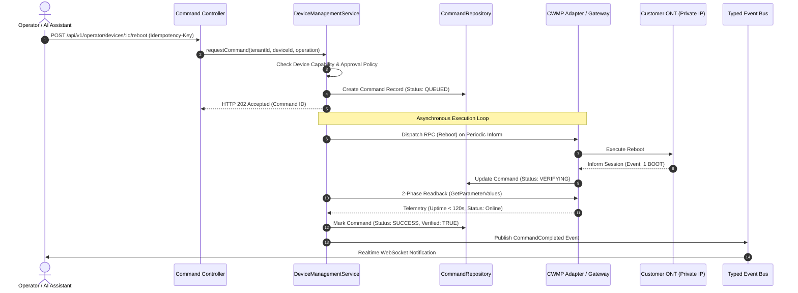

# AI ISP OS — Part 2.1 Engineering Data Flow & Repository Model

**Document Version:** 1.0  
**Specification:** Part 2.1 — Database & Data Model Specification  
**Date:** 2026-08-23  

---

## 1. Multi-Tier Data Access Architecture (Section 13)

To maintain clean architectural boundaries and prevent arbitrary unstructured queries from leaking into controllers, AI ISP OS adopts a strict layered data access pattern:

```
[ HTTP Controller / WebSocket Gateway ]
                   │
                   ▼ (DTO / Validated Input)
      [ Application Service Layer ]
 (Domain Rules, Approvals, Event Publishing)
                   │
                   ▼ (Tenant-Scoped Query Context)
     [ Domain Repository Layer ]
 (Tenant Enforcement, Index Optimization)
                   │
                   ▼ (Mongoose Schema / Driver)
         [ Primary Database Store ]
```

---

## 2. Asynchronous Command & 2-Phase Verification Data Flow (Section 15)



---

## 3. Optical Telemetry Ingestion & Anomaly Data Flow (Section 20)

```
[ OLT / CPE Periodic Inform ]
            │
            ▼ (Raw Optical dBm)
 [ Telemetry Ingestion Service ]
            │
            ├─► [ Device Current State Store ] (Fast Dashboard Cache)
            │
            ├─► [ Historical Telemetry Store ] (Time-Series Samples)
            │
            ▼
[ Anomaly Trajectory Analyzer ]
  ├── Variance <= 1.5 dB  ──> (OPTIMAL)
  ├── Drift > -27.0 dBm   ──> (GRADUAL_DEGRADATION Alert)
  └── Delta > 6.0 dB drop ──> (SUDDEN_DROP Incident Candidate)
            │
            ▼
  [ Event Bus / Incident Correlator ]
```
