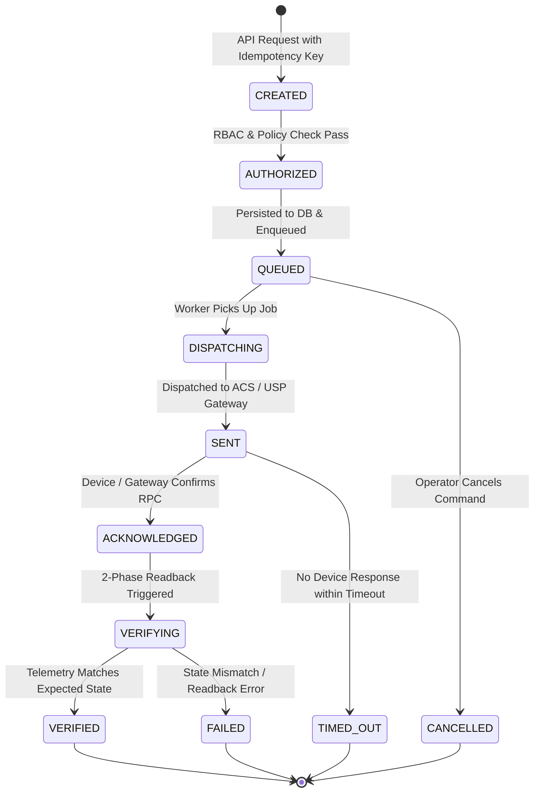

# AI ISP OS — Part 2.2 API Architecture & Contracts Specification

**Document Version:** 1.0  
**Specification:** Part 2.2 — Backend & API Implementation Specification  
**Date:** 2026-08-23  

---

## 1. Unified API Conventions (Section 6 & 7)

All public and internal endpoints follow standard enterprise conventions:
1. **JSON Envelope & UTC Timestamps:** All timestamps are formatted in UTC ISO-8601 strings.
2. **Correlation Tracking:** Every request extracts or generates `x-request-id` and `x-correlation-id` headers.
3. **Asynchronous Command Pattern:** Mutating network/device operations return `HTTP 202 Accepted` with a `commandId` / `jobId` payload.
4. **Standard Error Format:** Error responses strictly follow the canonical error envelope:
   ```json
   {
     "success": false,
     "error": {
       "code": "VALIDATION_ERROR",
       "message": "Invalid VLAN configuration",
       "requestId": "req_1724400000",
       "correlationId": "corr_1724400000",
       "retryable": false,
       "details": {}
     }
   }
   ```

---

## 2. Command Engine 8-State Lifecycle (Section 10)


