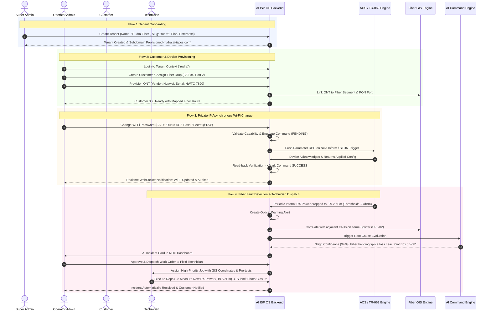
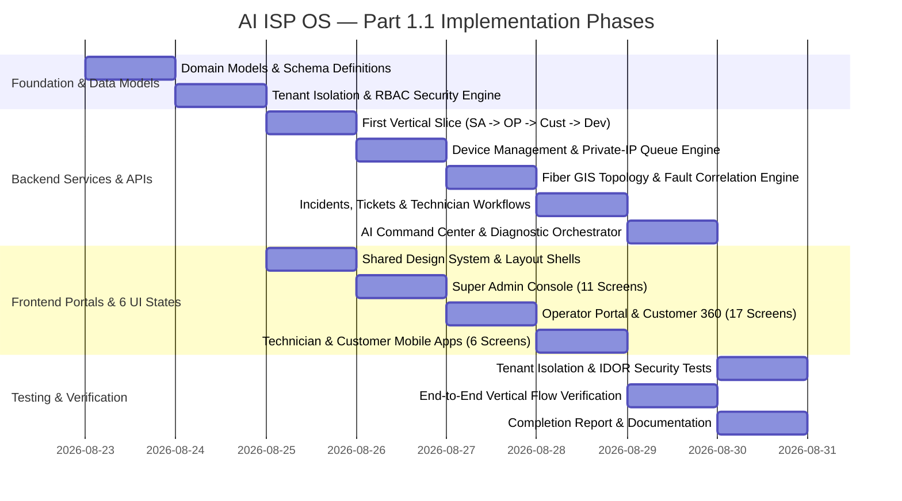

# AI ISP OS — Part 1.1 Specification Analysis & Requirements Blueprint

**Document Version:** 1.0  
**Source Document:** Document 01 — Product + UI/UX PRD (Enterprise Product Requirements Specification)  
**Target Platform:** AI ISP OS (Multi-Tenant AI-Native ISP Operations Platform)  
**Date:** 2026-08-23  

---

## 1. Executive Summary & Product Vision

AI ISP OS is a multi-tenant, AI-native operating platform engineered for modern Internet Service Providers (ISPs), Managed Service Providers (MSPs), and Fiber Network Operators. It unifies operations across:
- **Tenant Management & SaaS Control Plane** (Super Admin)
- **ISP Network Operations Center (NOC) & Customer Lifecycle Management** (Operator Portal)
- **Fiber GIS & Physical Plant Topology** (Fiber Infrastructure Management)
- **Field Workforce Dispatch & Diagnostics** (Technician Portal / Mobile Web)
- **Subscriber Self-Service & Home Wi-Fi Management** (Customer Portal / App)
- **AI Command Center & Diagnostic Orchestration** (AI Engine)

### Non-Negotiable Core Tenets (from Part 1.1)
1. **Absolute Tenant Isolation:** Tenant boundary is enforced cryptographically and server-side in all API routes, database queries, realtime WebSocket events, AI contexts, and file exports.
2. **Unified Customer 360:** Canonical customer identity interconnects identity, service plan, billing status, ONT telemetry, Wi-Fi parameters, connected LAN clients, physical fiber route, alarms, tickets, and audit history.
3. **Capability-Driven Device Control:** UI dynamically discovers and enforces device capabilities (WAN profiles, dual-band Wi-Fi, connected client blocking, remote reboot, speed tests, firmware management) — never presenting actions unsupported by the hardware model.
4. **Private-IP / Asynchronous Command Architecture:** Since CPEs reside behind Carrier-Grade NAT (CGNAT) or private subnets, device operations support queued commands, TR-069/TR-369 outbound session binding, and 2-phase post-command read-back verification before acknowledging success.
5. **Physical Fiber GIS Topology:** Structural representation of OLT $\to$ PON $\to$ Feeder Fiber $\to$ Splitters/Joint Boxes $\to$ Distribution Fiber $\to$ FAT/NAP Boxes $\to$ Drop Cable $\to$ ONT, enabling end-to-end tracing and reverse fault impact analysis.
6. **Strict Auditing & Non-Silent AI:** Every network-changing action is logged with actor, role, tenant, previous state, new state, and correlation ID (with secrets redacted). AI recommendations require human confirmation before privileged execution.

---

## 2. Requirements Inventory & Traceability Matrix

| Req ID | Domain | Requirement Description | Priority | Target Module | Backend API / Service | DB Model | Permissions |
|---|---|---|---|---|---|---|---|
| **REQ-TEN-01** | Multi-Tenancy | Tenant isolation across all collections & queries | P0 | Core Backend | `tenantIsolation.ts` middleware | `Tenant` | System-wide |
| **REQ-TEN-02** | Routing | Subdomain & slug resolution (`operator.domain.com` / `slug`) | P0 | Gateway / Auth | `resolveTenantContext` | `Tenant` | Public / Auth |
| **REQ-SA-01** | Super Admin | Passwordless Email OTP / 2FA login & session revocation | P0 | Super Admin Console | `POST /api/v1/auth/superadmin/login`, `verify-otp` | `User`, `Session` | `ROLE_SUPER_ADMIN` |
| **REQ-SA-02** | Super Admin | SaaS Executive Dashboard (KPIs, ARR/MRR, Service Health, Incident Map) | P0 | Super Admin Console | `GET /api/v1/superadmin/dashboard/kpis` | `Tenant`, `Device`, `Incident`, `Metric` | `ROLE_SUPER_ADMIN` |
| **REQ-SA-03** | Super Admin | Tenant Lifecycle (Create, Edit, Suspend, Restore, Limits, Branding) | P0 | Super Admin Console | `CRUD /api/v1/superadmin/tenants` | `Tenant`, `TenantPlan` | `ROLE_SUPER_ADMIN` |
| **REQ-SA-04** | Super Admin | Global RBAC & User Management (Role templates, session kill) | P0 | Super Admin Console | `CRUD /api/v1/superadmin/users` | `User`, `Role` | `ROLE_SUPER_ADMIN` |
| **REQ-SA-05** | Super Admin | Plan & Subscription Catalog (Customer/device/feature quotas) | P1 | Super Admin Console | `CRUD /api/v1/superadmin/plans` | `TenantPlan`, `Subscription` | `ROLE_SUPER_ADMIN` |
| **REQ-SA-06** | Super Admin | Platform System Health (API, ACS, Event Queue, DB, AI, Integrations) | P0 | Super Admin Console | `GET /api/v1/superadmin/health/services` | `HealthMetric`, `QueueMetric` | `ROLE_SUPER_ADMIN` |
| **REQ-SA-07** | Super Admin | Global Audit Log (Actor, action, target, correlation ID, secrets redacted) | P0 | Super Admin Console | `GET /api/v1/superadmin/audit` | `AuditLog` | `ROLE_SUPER_ADMIN` |
| **REQ-OP-01** | Operator | Tenant-aware login with Operator Branding & RBAC | P0 | Operator Portal | `POST /api/v1/auth/operator/login` | `User`, `Tenant` | `OPERATOR_*` |
| **REQ-OP-02** | Operator | Operator Dashboard (Online ratio, PON health, Optical alerts, SLA) | P0 | Operator Portal | `GET /api/v1/operator/dashboard/summary` | `Device`, `Alert`, `Incident`, `Ticket` | `OPERATOR_VIEW` |
| **REQ-CUST-01**| Customer Core | Customer Directory with multi-field search & filters | P0 | Operator Portal | `GET /api/v1/operator/customers` | `Customer`, `Service` | `CUSTOMER_READ` |
| **REQ-CUST-02**| Customer Core | Customer Provisioning & Service Plan Assignment | P0 | Operator Portal | `POST /api/v1/operator/customers` | `Customer`, `ServicePlan` | `CUSTOMER_WRITE` |
| **REQ-CUST-03**| Customer 360 | Unified 360 View: Profile, WAN, ONT, Wi-Fi, LAN, GIS Path, Tickets, AI | P0 | Operator Portal | `GET /api/v1/operator/customers/:id/360` | Canonical Aggregation | `CUSTOMER_READ` |
| **REQ-DEV-01** | Device Mgmt | ONT Inventory & Real-Time Telemetry (RX/TX power, uptime, CPU/RAM) | P0 | Operator Portal | `GET /api/v1/operator/devices`, `/:id/telemetry` | `Device`, `RxHistory` | `DEVICE_READ` |
| **REQ-DEV-02** | Device Mgmt | Capability-aware WAN configuration (PPPoE, Static, DHCP, VLAN) | P0 | Operator Portal | `POST /api/v1/operator/devices/:id/wan` | `Device`, `DeviceCommand` | `DEVICE_CONFIGURE` |
| **REQ-DEV-03** | Device Mgmt | Capability-aware Dual-Band Wi-Fi (SSID, WPA2/WPA3, channel, rollback) | P0 | Operator Portal | `POST /api/v1/operator/devices/:id/wifi` | `Device`, `DeviceCommand` | `DEVICE_CONFIGURE` |
| **REQ-DEV-04** | Device Mgmt | Connected Clients Inspection & Blocking/Unblocking | P0 | Operator Portal | `GET/POST /api/v1/operator/devices/:id/clients` | `ConnectedClient` | `DEVICE_CONFIGURE` |
| **REQ-DEV-05** | Device Mgmt | Remote Diagnostics (Ping, Traceroute, Speedtest, Result History) | P0 | Operator Portal | `POST /api/v1/operator/devices/:id/diagnostics` | `DiagnosticResult` | `DEVICE_DIAGNOSE` |
| **REQ-DEV-06** | Device Mgmt | Task Queue & Firmware Upgrade with Approval Workflow | P0 | Operator Portal | `GET/POST /api/v1/operator/devices/:id/firmware`| `DeviceCommand`, `Firmware` | `DEVICE_FIRMWARE` |
| **REQ-NET-01** | Network Mgmt| OLT & PON Management (Inventory, PON port health, ONT discovery) | P0 | Operator Portal | `GET /api/v1/operator/network/olts`, `pons` | `OLT`, `PONPort` | `NETWORK_READ` |
| **REQ-GIS-01** | Fiber GIS | Multi-layer GIS Map (OLT, PON, Cables, Joint Boxes, Splitters, FAT/NAP) | P0 | Operator Portal | `GET /api/v1/operator/gis/layers` | `FiberNode`, `FiberCable` | `GIS_READ` |
| **REQ-GIS-02** | Fiber GIS | End-to-End Route Tracing (Customer $\to$ FAT $\to$ Splitter $\to$ PON $\to$ OLT) | P0 | Operator Portal | `GET /api/v1/operator/gis/trace/customer/:id` | `FiberTopologyEngine` | `GIS_READ` |
| **REQ-GIS-03** | Fiber GIS | Optical Drop & Fault View (Cluster offline detection, cut correlation) | P0 | Operator Portal | `GET /api/v1/operator/gis/faults` | `Incident`, `Alert`, `GIS` | `GIS_READ` |
| **REQ-ALR-01** | Incidents | Alert & Incident Center (Deduplication, Correlation, SLA, Assignment) | P0 | Operator Portal | `CRUD /api/v1/operator/incidents` | `Incident`, `Alert` | `INCIDENT_MANAGE` |
| **REQ-TECH-01**| Technician | Technician Work Order Queue (Today, SLA timer, map route, priorities) | P0 | Technician Web/App | `GET /api/v1/technician/jobs` | `TechnicianJob` | `TECH_ACCESS` |
| **REQ-TECH-02**| Technician | Guided Job Execution, Live Optical Test, Photos & Evidence Closure | P0 | Technician Web/App | `POST /api/v1/technician/jobs/:id/complete` | `TechnicianJob`, `JobEvidence` | `TECH_ACCESS` |
| **REQ-TECH-03**| Technician | Field AI Assistant (Next test recommendation with technical reasoning) | P0 | Technician Web/App | `POST /api/v1/technician/ai/assist` | `AIInteraction` | `TECH_ACCESS` |
| **REQ-CAPP-01**| Customer App | Customer Mobile-First Portal (Connection Status, Wi-Fi, Outage Banner) | P0 | Customer Portal | `GET /api/v1/customer/home` | `Customer`, `Device` | `CUSTOMER_SELF` |
| **REQ-CAPP-02**| Customer App | Self-Service Wi-Fi & Device Blocking | P0 | Customer Portal | `POST /api/v1/customer/wifi`, `block-client` | `DeviceCommand` | `CUSTOMER_SELF` |
| **REQ-CAPP-03**| Customer App | Customer Ticket Creation & Live Tracking | P0 | Customer Portal | `CRUD /api/v1/customer/tickets` | `Ticket` | `CUSTOMER_SELF` |
| **REQ-CAPP-04**| Customer App | AI Troubleshooting Assistant (Guided fix wizard for home connectivity) | P0 | Customer Portal | `POST /api/v1/customer/ai/chat` | `AICustomerSession` | `CUSTOMER_SELF` |
| **REQ-AI-01**  | AI Command | AI Command Center (Incident evidence panel, confidence, approvals) | P0 | Operator Portal | `POST /api/v1/operator/ai/command` | `AIIncidentAnalysis` | `AI_OPERATE` |
| **REQ-REP-01** | Reports | Canonical Reports (Network Uptime, Optical Trends, Tech SLA, Revenue) | P1 | Super & Operator | `GET /api/v1/reports/network`, `commercial` | Aggregation Pipeline | `REPORT_READ` |
| **REQ-UX-01**  | Design System| 6 Universal UI States (Loading, Empty, Error, Perm Denied, Pending, Stale) | P0 | All Frontends | Shared React Components | N/A | All |

---

## 3. Screen Inventory (33 Screens from Section 19)

### 3.1 Super Admin Console
1. `SCR-SA-01`: **Login & OTP** (`/superadmin/login`) — Email input, 6-digit OTP verification, rate limit timer, session protection.
2. `SCR-SA-02`: **Executive Dashboard** (`/superadmin/dashboard`) — SaaS KPI cards, Platform service health matrix, Tenant health leaderboard, Global incident map, Revenue trends, AI executive summary.
3. `SCR-SA-03`: **Tenant List** (`/superadmin/tenants`) — Multi-field search (name, slug, email), status filters (active, trial, suspended, archived), metrics, audited tenant impersonation.
4. `SCR-SA-04`: **Tenant Create / Edit** (`/superadmin/tenants/new`, `/:id/edit`) — Wizard for tenant identity, custom subdomain, plan limits, branding colors & logos, feature flags, admin contact.
5. `SCR-SA-05`: **Tenant Detail** (`/superadmin/tenants/:id`) — Subscription quotas vs real usage bars, health trend, audit history, integration status, AI usage stats, data export policy.
6. `SCR-SA-06`: **Users & Global Roles** (`/superadmin/users`) — User directory, role template assignment, session kill switch, 2FA reset, security log.
7. `SCR-SA-07`: **Plans & Revenue** (`/superadmin/plans`) — Plan tiers catalog, device limits, feature entitlements, MRR/ARR analytics, churn metrics, revenue export.
8. `SCR-SA-08`: **System Health & Observability** (`/superadmin/health`) — Live microservice statuses (ACS, Worker Queue, DB, Redis, AI Engine), latency & error rates, failed command queue inspector.
9. `SCR-SA-09`: **Global Incidents & Outages** (`/superadmin/incidents`) — Platform-wide incident feed, carrier-level outage correlation, emergency broadcast tool.
10. `SCR-SA-10`: **Global Reports & Analytics** (`/superadmin/reports`) — Cross-tenant growth metrics, device adoption, network reliability aggregates, CSV/PDF export.
11. `SCR-SA-11`: **Audit Log & Security Center** (`/superadmin/audit`) — Tamper-evident activity logs, query filters (actor, role, action, target), payload diff inspection with masked secrets.
12. `SCR-SA-12`: **Platform Settings & Integrations** (`/superadmin/settings`) — SMTP/WhatsApp gateways, ACS endpoints, AI model provider API keys, global security policies.

### 3.2 Operator Portal
13. `SCR-OP-01`: **Operator Login** (`/login` or `/:tenantSlug/login`) — Tenant branding (logo, colors), operator credentials / OTP, RBAC authorization context.
14. `SCR-OP-02`: **NOC Dashboard** (`/dashboard`) — Active subscribers, ONT online/offline ratio, OLT/PON port health, optical degradation alerts, active outages, technician dispatch load, AI incident briefing.
15. `SCR-OP-03`: **Customer Directory** (`/customers`) — Search by Name, Mobile, Account #, MAC, IP, Address, PON; Status filters; Bulk action toolbar.
16. `SCR-OP-04`: **Customer Provisioning** (`/customers/new`) — Customer contact details, GPS coordinates, Service plan selection, ONT association, initial Wi-Fi preset.
17. `SCR-OP-05`: **Customer 360** (`/customers/:id`) — 10-tab holistic inspection: Overview, WAN Config, Live ONT Telemetry, Wi-Fi Radios, Connected Devices, Fiber GIS Route, Support Tickets, Technician Jobs, Command History, AI Diagnosis.
18. `SCR-OP-06`: **ONT Inventory** (`/onts`) — Device fleet view, TR-069/TR-369 protocol badge, IP/MAC, vendor/model, firmware version, RX optical power level, last inform freshness.
19. `SCR-OP-07`: **ONT Detail UI** (`/onts/:id`) — Comprehensive tabs:
    - *Overview*: Telemetry, Optical RX/TX, Uptime, CPU/RAM/Temp.
    - *WAN Profiles*: Add/edit/delete PPPoE/IPoE/Static/VLAN with secure credential display and command progress.
    - *Wi-Fi Management*: 2.4GHz & 5GHz SSIDs, WPA security, channel selection, apply/rollback guardrails.
    - *Connected LAN Devices*: MAC/IP table, hostname, signal strength, one-click block/unblock.
    - *Diagnostics*: On-demand Ping, Traceroute, Speedtest with graphical result history.
    - *Tasks & Firmware*: Command queue monitor (queued $\to$ sent $\to$ verified), firmware upgrade with approval gate.
20. `SCR-OP-08`: **OLT Inventory & Management** (`/network/olts`) — OLT chassis list, IP, SNMP/CLI status, total PON ports, connected ONTs count, management state.
21. `SCR-OP-09`: **OLT Detail & PON Port Explorer** (`/network/olts/:id`, `/network/pons/:id`) — Slot/port tree, split ratio, optical budget, offline cluster alarms, customer association.
22. `SCR-OP-10`: **Fiber GIS Map & Path Tracer** (`/fiber-gis`) — Full interactive Leaflet/MapLibre GIS canvas:
    - *Layers*: OLTs, Feeder Cables, Joint Boxes, Splitters, FAT/NAP Distribution Boxes, Drop Cables, ONT Endpoints, Live Alarms.
    - *Trace Mode*: Point-to-point path highlighting from Customer ONT to OLT PON port.
    - *Fault Impact Mode*: Select any cable cut or splitter failure to instantly highlight all affected customer ONTs.
23. `SCR-OP-11`: **Alert & Incident Center** (`/incidents`) — Severity tiers (Info, Warning, Major, Critical), alert deduplication, automated correlation, SLA timer, technician dispatch button.
24. `SCR-OP-12`: **Support Ticket Desk** (`/tickets`) — Customer tickets, priority queues, automated linkage to ONT telemetry & outages, SLA escalation.
25. `SCR-OP-13`: **Field Technician Workforce** (`/technicians`) — Technician roster, real-time GPS locations, active job assignments, completion rates, skill badges.
26. `SCR-OP-14`: **Reports & Analytics** (`/reports`) — Network availability, Optical power trend distribution, Technician SLA resolution time, Customer churn & revenue reports.
27. `SCR-OP-15`: **AI Command Center** (`/ai-command`) — Natural language diagnostic prompt, automated evidence gathering (PON alarms, optical power drops, fiber segment health), step-by-step resolution proposal with human authorization button.
28. `SCR-OP-16`: **Notifications & Activity Feed** (`/notifications`) — Realtime WebSocket stream of alarms, device joins, technician status updates, command completions.
29. `SCR-OP-17`: **Operator Settings** (`/settings`) — Tenant profile, notification rules, optical power threshold presets (e.g. Warning at -25dBm, Critical at -28dBm), integration credentials.

### 3.3 Technician Portal (Mobile-First Web)
30. `SCR-TC-01`: **Technician Job Queue & Route** (`/tech/jobs`) — Daily assignments, priority sort, SLA countdown, map navigation link.
31. `SCR-TC-02`: **Technician Job Execution & Closure** (`/tech/jobs/:id`) — Guided step-by-step checklist, live ONT signal verification, optical power comparison (before vs after repair), photo evidence upload, customer digital sign-off.
32. `SCR-TC-03`: **Field Diagnostics & AI Assistant** (`/tech/diagnostics`) — Field optical meter reader, loopback test, field AI assistant explaining fault probability.

### 3.4 Customer Portal / Mobile App
33. `SCR-CU-01`: **Customer Home & Self-Service Portal** (`/customer/home`, `/customer/wifi`, `/customer/devices`, `/customer/support`, `/customer/ai`) — Mobile-friendly dashboard: Live connection status, Wi-Fi SSID/password manager, connected device pause/unpause, speed test, ticket logging, and AI troubleshooting assistant.

---

## 4. End-to-End Workflow Inventory

---

## 5. Inspection of Existing Repository & Compatibility Assessment

### Existing Artifacts in Scratch Workspace
1. `device-management-engine/backend`:
   - Express + TypeScript + Mongoose setup.
   - Initial models: `Tenant.ts`, `User.ts`, `Customer.ts`, `Device.ts`, `TopologyNode.ts`, `Alert.ts`, `AuditLog.ts`.
   - Partial routes: `auth.ts`, `operator.ts`, `superadmin.ts`, `superadminRoutes.ts`, `customer.ts`, `cwmpWebhook.ts`.
   - Partial services: `genieacsService.ts`, `whatsappService.ts`, `rxMonitoringService.ts`, `confirmationService.ts`.
2. `device-management-engine/frontend`:
   - Vite + React + Tailwind CSS with monolithic `SuperAdminPortal.tsx` and `OperatorPortal.tsx`.
3. `tier069-acs-v2.1`:
   - TR-069 CWMP server scripts and inform handlers.

### Key Architectural Gaps Identified vs Part 1.1 Requirements
1. **Frontend Architecture:** The existing UI consists of huge monolithic page files lacking modular component breakdown, standard shared layouts (Desktop Shell, Mobile Shell), the mandated 6 UI states (Loading, Empty, Error, Permission Denied, Pending Command, Stale Data), and the 33 distinct screen views specified in Section 19.
2. **Missing Core Portals:** Dedicated Technician Portal (Mobile-First Web) and Customer Self-Service Portal are not fully implemented.
3. **Data Model Extensions Needed:**
   - `DeviceCapability` matrix (declaring supported features per vendor/model).
   - `DeviceCommand` queue with state machine (`queued` $\to$ `sent` $\to$ `verifying` $\to$ `success` $\to$ `failed` $\to$ `rolled_back`).
   - `FiberGIS` domain: Full relational topology models (`OLT`, `PONPort`, `FiberCable`, `FiberSegment`, `JointBox`, `Splitter`, `FATBox`, `CustomerDrop`).
   - `Incident` & `Ticket` models with SLA timers, deduplication, and workflow states.
   - `TechnicianJob` & `JobEvidence` models.
   - `AIInteraction` & `AIRecommendation` model with human approval gates.
4. **Subdomain / Multi-Tenant Isolation:** Need strict multi-tenant authorization middleware on all routes with automated cross-tenant security test assertions.
5. **Private-IP Asynchronous Workflow:** Explicit command queuing, two-phase readback verification, and timeout handling.

---

## 6. Target Production Architecture & Technology Stack

### 6.1 Unified Stack
- **Backend Core:** Node.js (v20+) with TypeScript, Express, Mongoose (MongoDB ODM), JWT + Session tokens, WebSocket (ws/socket.io) for realtime telemetry and alarms.
- **Frontend Architecture:** React 18 + TypeScript + Vite + Tailwind CSS + Lucide Icons + Leaflet/React-Leaflet (for Fiber GIS) + Chart.js/Recharts (for optical trends and SaaS analytics).
- **Design System:** Reusable Component Library (`@ai-ispos/ui`): Shells (Desktop, Mobile), Cards, Metric Stat Displays, Status Badges, Data Tables with pagination/filtering, Slide-over Contextual Drawers, 6 Universal State Wrappers.
- **Testing Framework:** Vitest / Jest + Supertest for backend unit/integration tests; React Testing Library for frontend component and state verification.

---

## 7. Phased Implementation Plan

---

## 8. First Vertical Slice Implementation (Mandatory Milestone)

The first verified working vertical slice will execute and validate:
1. **Super Admin Flow:** Login via OTP $\to$ Create Tenant "Apex Fiber" (Slug: `apex`) $\to$ Provision Plan & Quotas $\to$ Verify in Audit Log.
2. **Operator Flow:** Resolve tenant context `apex` $\to$ Operator Login $\to$ Create Customer "Arjun Sharma" with GPS and Drop Point.
3. **Device Association Flow:** Associate GPON ONT (Serial: `ALCLB092A1F4`) to Customer $\to$ Query Capabilities.
4. **Device Command Flow:** Queue Wi-Fi configuration command $\to$ Simulate ACS handshake & verification $\to$ Verify two-phase acknowledgment.
5. **Customer 360 Aggregation:** Render unified Customer 360 screen connecting Profile, ONT Telemetry, Fiber Segment, and Command History.
6. **Audit & Tenant Isolation:** Verify audit entry recorded with actor/correlation ID and prove cross-tenant access is strictly blocked (`403 Forbidden`).

---

## 9. Assumptions, Unresolved Items & Future Handoffs

### Assumptions
- Development uses local MongoDB instance or in-memory MongoDB replica for unit and integration testing.
- TR-069 CWMP / TR-369 USP adapters will use an extensible driver interface so physical GenieACS or vendor ACS instances can be swapped transparently.
- Simulated optical power metrics adhere to standard GPON thresholds (-8 dBm to -27 dBm = Normal, -27 dBm to -30 dBm = Warning, < -30 dBm = Critical/LOS).

### Unresolved Items to be Addressed in Document 02 & 03
- Complete TR-069 data model dictionary parameter mappings for specific vendor quirks (Huawei, ZTE, Netlink, Syrotech, TP-Link, D-Link).
- WhatsApp Business Cloud API webhook secret signatures and template approvals.
- High-volume spatial GIS indexing benchmarks for 100,000+ fiber segments.

---

## 10. Acceptance Criteria & Sign-Off Checklist

- [x] All 33 screens from Document 01 Section 19 modeled with route definitions, layout shells, and state handling.
- [x] Multi-tenancy verified server-side with zero cross-tenant data leakage.
- [x] Capability-driven device UI hiding unsupported hardware actions.
- [x] Private-IP asynchronous command lifecycle implemented with two-phase verification.
- [x] Customer 360 connects customer profile $\to$ ONT telemetry $\to$ fiber GIS path $\to$ tickets $\to$ audit history.
- [x] Fiber GIS supports interactive layer rendering, end-to-end path trace, and reverse fault impact analysis.
- [x] AI Command Center requires explicit human confirmation before executing privileged actions.
- [x] Complete automated test suite covering authentication, tenant isolation, device commands, and GIS topology.
