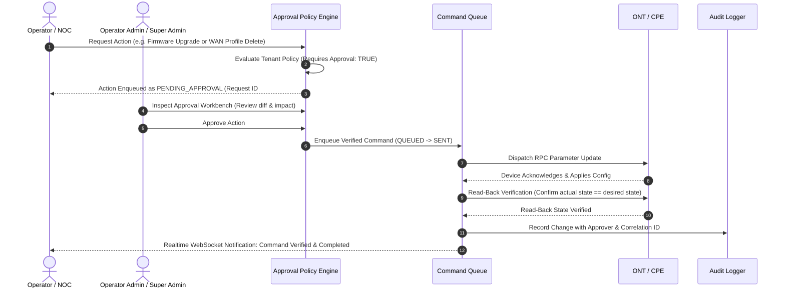
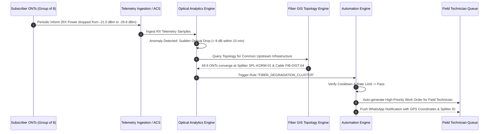

# AI ISP OS — Part 1.2 Functional Specification Analysis & Traceability Matrix

**Document Version:** 1.0  
**Source Document:** Document 02 — Functional PRD (Enterprise Functional Requirements Specification)  
**Parent Foundation:** Document 01 — Product + UI/UX PRD (Part 1.1)  
**Date:** 2026-08-23  

---

## 1. Executive Summary & Architectural Continuity

Document 02 (Part 1.2) establishes the **functional behavior, business rules, operational logic, vendor adapter architectures, automation engine, messaging boundaries, and verification pipelines** that power the UI and core systems established in Part 1.1.

Part 1.2 **extends and deepens** the existing AI ISP OS architecture:
- **No Duplicate Models:** Reuses canonical `Tenant`, `User`, `Customer`, `Device`, `FiberTopology`, `Incident`, `Ticket`, `TechnicianJob`, and `AuditLog` entities.
- **Protocol-Neutral Vendor Adapters:** Formalizes the TR-069 and TR-369/USP driver adapters with parameter transformation dictionaries for Huawei, ZTE, Nokia, Netlink, and TP-Link.
- **Approval Policy Engine:** High-risk operations (device reboot, WAN profile deletion, firmware upgrades, bulk changes) pass through a tenant-configurable policy engine requiring authorization.
- **Optical Health & Anomaly Detector:** Distinguishes sudden fiber cuts from gradual splice degradation, tracking baselines and power drop trajectories.
- **Event-Driven Automation Engine:** Trigger-condition-action pipeline with cooldowns, rate limits, and audit logging.
- **WhatsApp / Messaging Gateway Boundary:** Abstracted notifications provider for outages, tech dispatches, and ticket updates with throttling and secret masking.
- **Hardware Asset Lifecycle:** Tracking inventory states (`available`, `assigned`, `installed`, `faulty`, `retired`).

---

## 2. Requirements Traceability Matrix (Document 02 / Part 1.2)

| Req ID | Domain | Functional Requirement | Priority | Module | API / Backend Service | Model Changes |
|---|---|---|---|---|---|---|
| **REQ-FNC-01** | Policy & Approvals | Policy engine requiring approval for high-risk operations (reboot, WAN deletion, firmware flash) | P0 | Security & Workflow | `approvalPolicyService.ts`, `POST /api/v1/operator/approvals` | `ApprovalPolicy`, `ApprovalRequest` |
| **REQ-FNC-02** | Device Adapters | Vendor parameter transformation dictionaries & protocol normalization (Huawei, ZTE, Nokia, Netlink) | P0 | Device Engine | `vendorAdapterService.ts`, `tr069Adapter.ts`, `uspAdapter.ts` | `DeviceAdapterProfile` |
| **REQ-FNC-03** | Asynchronous WAN | Complete WAN lifecycle: permission $\to$ capability $\to$ validation $\to$ queue $\to$ apply $\to$ read-back $\to$ verify $\to$ audit | P0 | Device Engine | `deviceManagementService.ts`, `CRUD /api/v1/operator/devices/:id/wan` | `DeviceCommand` (extended) |
| **REQ-FNC-04** | Wi-Fi Lifecycle | Radio validation, password policy check, two-phase readback verification | P0 | Device Engine | `deviceManagementService.ts`, `POST /api/v1/operator/devices/:id/wifi` | `DeviceCommand` |
| **REQ-FNC-05** | Reboot & Loop Detect | Reboot queue, post-reboot online verification, reboot loop anomaly detection | P0 | Device Engine | `deviceManagementService.ts`, `incidentService.ts` | `Device` (uptime tracking) |
| **REQ-FNC-06** | Optical Health | Baseline calculation, sudden drop vs gradual degradation trajectory detection | P0 | Monitoring | `opticalMonitoringService.ts`, `GET /api/v1/operator/devices/:id/optical-analytics` | `Device` (rxHistory baseline) |
| **REQ-FNC-07** | GIS Fault Correlation | Reverse graph traversal: Correlates multiple degraded/offline ONTs to common upstream Splitter or Fiber Segment | P0 | Fiber GIS | `fiberGisService.ts`, `POST /api/v1/operator/gis/correlate-faults` | `FiberTopology` |
| **REQ-FNC-08** | AI Diagnostic Pipeline | Evidence retrieval $\to$ hypothesis ranking $\to$ safe test suggestion $\to$ approval $\to$ verification $\to$ outcome storage | P0 | AI Command | `aiCommandService.ts`, `POST /api/v1/operator/ai/command` | `AIInteraction` |
| **REQ-FNC-09** | Field Tech Lifecycle | Job assignment $\to$ route $\to$ arrival $\to$ checklist $\to$ optical verification $\to$ photo evidence $\to$ signature $\to$ closure | P0 | Technician | `technicianService.ts`, `technicianRoutes.ts` | `TechnicianJob`, `JobEvidence` |
| **REQ-FNC-10** | Messaging Gateway | Multi-channel messaging boundary (WhatsApp / SMS / Email) with throttling, deduplication, and template rendering | P0 | Integrations | `messagingService.ts`, `POST /api/v1/operator/notifications/broadcast` | `NotificationLog`, `MessageTemplate` |
| **REQ-FNC-11** | Automation Engine | Rule-based event automation (Trigger $\to$ Condition $\to$ Action) with rate limits and cooldown guards | P1 | Automation | `automationEngineService.ts`, `CRUD /api/v1/operator/automation-rules` | `AutomationRule`, `AutomationLog` |
| **REQ-FNC-12** | Asset Lifecycle | ONT & OLT asset inventory status (`available`, `assigned`, `installed`, `faulty`, `retired`) | P1 | Inventory | `inventoryService.ts`, `CRUD /api/v1/operator/inventory` | `InventoryItem` |

---

## 3. Workflow Specifications

### Workflow 1: High-Risk Action Policy & Human Approval Gate

### Workflow 2: Automated Optical Degradation Correlation & Anomaly Detection

---

## 4. Database Schema Extensions (Document 02)

1. **`ApprovalPolicy.ts` & `ApprovalRequest.ts`**:
   - Manages tenant policies declaring which operations require approval (reboot, WAN deletion, firmware flash, bulk customer actions).
   - Stores approval requests with requester, target entity, previous state, requested state, approver, status (`pending`, `approved`, `rejected`), and timestamp.
2. **`DeviceAdapterProfile.ts`**:
   - Vendor parameter dictionaries mapping standardized concepts (`InternetGatewayDevice.WANDevice.1...` vs `Device.IP.Interface.1...`) across Huawei, ZTE, Nokia, Netlink, and TP-Link.
3. **`AutomationRule.ts` & `AutomationLog.ts`**:
   - Rule definition: Trigger (Alarm, Optical Drop, Ticket Created), Conditions (Severity, Area, Threshold), Actions (Notify, Dispatch Tech, Run Diagnostic), Cooldown period (minutes), and execution logs.
4. **`InventoryItem.ts`**:
   - Hardware asset tracking: Serial, MAC, Vendor, Model, Hardware Type, Status (`available`, `assigned`, `installed`, `faulty`, `retired`), Assigned Customer ID, Batch/Invoice number.
5. **`NotificationLog.ts` & `MessageTemplate.ts`**:
   - WhatsApp/SMS/Email templates and delivery logs with status (`queued`, `sent`, `delivered`, `failed`), recipient, and retry counts.

---

## 5. Implementation Roadmap & Milestones

- **Phase 1: Backend Domain Extensions**:
  - Implement `ApprovalPolicy`, `ApprovalRequest`, `AutomationRule`, `InventoryItem`, and `DeviceAdapterProfile` models.
  - Implement `approvalPolicyService.ts`, `vendorAdapterService.ts`, `opticalMonitoringService.ts`, `automationEngineService.ts`, and `messagingService.ts`.
- **Phase 2: Extended API Routes & Workflows**:
  - Approval workbench endpoints (`GET /api/v1/operator/approvals`, `POST /:id/approve`, `POST /:id/reject`).
  - Optical analytics & anomaly trajectory endpoints (`GET /api/v1/operator/optical/analytics`).
  - Automation rules manager (`CRUD /api/v1/operator/automation-rules`).
  - Hardware inventory lifecycle (`CRUD /api/v1/operator/inventory`).
  - Messaging broadcast & notification triggers (`POST /api/v1/operator/messaging/send`).
- **Phase 3: Frontend UI Enhancements**:
  - Approval Policy & Pending Requests Workbench in Operator Portal.
  - Optical Power Degradation Trajectory Chart & Anomaly Inspector in Customer 360 & ONT Detail.
  - Automation Rules Configuration Manager.
  - Hardware Asset Inventory Workbench.
- **Phase 4: Verification & Automated Tests**:
  - Approval gate enforcement test.
  - Vendor parameter adapter transformation test.
  - Optical anomaly correlation & auto-dispatch test.
  - Full regression test against Part 1.1 test suite.
