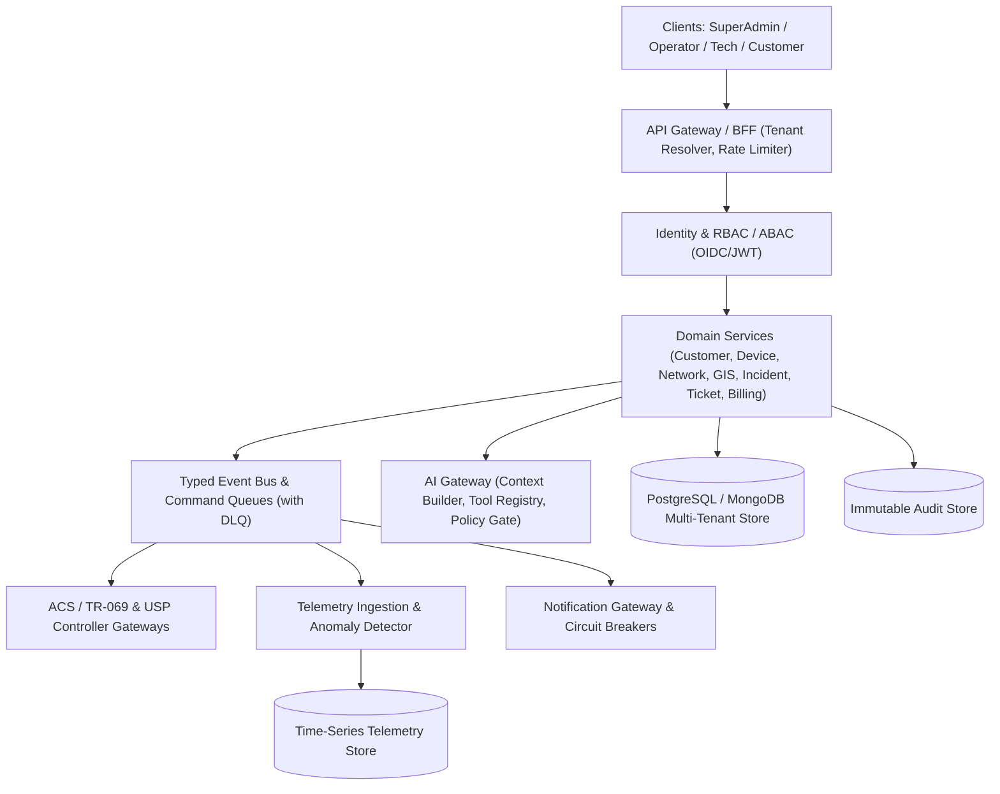

# AI ISP OS — Part 1.3 Technical Architecture Analysis & Specification

**Document Version:** 1.0  
**Source Document:** Document 03 — Technical Architecture PRD (Enterprise System Architecture Specification)  
**Parent Foundations:** Document 01 (Part 1.1) & Document 02 (Part 1.2)  
**Date:** 2026-08-23  

---

## 1. Executive Summary

Document 03 (Part 1.3) defines the **production-oriented technical architecture, service boundaries, communication protocols, event-driven pipelines, AI tool registry & verification gates, observability metrics, resilience mechanisms (circuit breakers, dead-letter queues, command idempotency), and security threat model** for AI ISP OS.

This phase hardens and productionizes the systems created in Parts 1.1 and 1.2:
- **Event-Driven Messaging Bus & Dead-Letter Queue (DLQ):** Implements an enterprise event bus with typed events (`CPEInformed`, `CommandCompleted`, `OpticalThresholdCrossed`, `FiberIncidentCandidate`, `TicketCreated`, `JobAssigned`, `AIRecommendationCreated`), idempotency checks, and dead-letter queues for unprocessable messages.
- **AI Tool Registry & Policy Gateway:** Implements the strict AI safety architecture from Section 13: `AI Context Builder` (tenant-isolated data only) $\to$ `AI Tool Registry` (safe deterministic tools: `readTelemetry`, `runDiagnostic`, `createTicket`, `requestReboot`) $\to$ `AI Policy Engine` (evaluates permissions and human approval gates) $\to$ `Verification Layer` (inspects post-action state) $\to$ `AI Audit Store`.
- **Circuit Breaker & Resilience Engine:** Implements the circuit breaker pattern for external messaging (WhatsApp), payment APIs, and remote ACS endpoints with automatic state transitions (`CLOSED`, `OPEN`, `HALF_OPEN`).
- **Distributed Observability & Metrics Collector:** Structured JSON logger with `request_id`, `tenant_id`, `service`, `severity`, `correlation_id`, tracking API latency, command queue depth, event lag, telemetry ingestion rates, and AI token cost metrics.
- **Full OpenAPI Schema & Specification:** Formally documented API contracts with idempotency keys, tenant scoping, and structured error responses.

---

## 2. Service Boundaries & Data Layer Architecture

---

## 3. Detailed Component Breakdown

### 3.1 Typed Event Bus & Dead-Letter Queue (`eventBusService.ts`)
Implements the events declared in Section 7 of Document 03:
- `CPEInformed`: Ingests periodic ONT telemetry and updates device current state.
- `CommandCompleted`: Dispatches post-command read-back verification and notifies UI via WebSocket.
- `OpticalThresholdCrossed`: Triggers alert correlation and automated technician dispatch rules.
- `FiberIncidentCandidate`: Correlates multiple ONT power drops to upstream Splitter or Feeder cable.
- `TicketCreated` & `JobAssigned`: Updates CRM and dispatches mobile push notifications.
- `AIRecommendationCreated`: Enqueues action recommendation for human approval.
- **Dead-Letter Queue (DLQ)**: Retains failed event payloads with failure reason, retry count, and manual redrive capabilities.

### 3.2 AI Tool Registry & Controlled Execution Pipeline (`aiToolRegistry.ts`)
Enforces the mandatory AI security model from Section 13 & 25 of Document 03:
- **No Direct Infrastructure Execution:** The AI model is strictly prohibited from direct database/device writes.
- **Deterministic Safe Tools:**
  1. `getDeviceTelemetry(deviceId)`: Read-only optical power, Wi-Fi status, uptime.
  2. `traceFiberRoute(customerId)`: Read-only GIS spatial path.
  3. `checkPonAlarms(ponId)`: Read-only PON port alarms and connected ONT health.
  4. `proposeRemediation(actionType, params)`: Submits action proposal into approval queue.
- **Human Approval Gate:** Privileged actions (`REBOOT_DEVICE`, `DELETE_WAN_PROFILE`, `AUTO_REBOOT_ONT`) are held in `pending_approval` until authorized by an administrator.

### 3.3 Circuit Breaker Pattern (`circuitBreaker.ts`)
Implements Section 19 reliability patterns for external integrations:
- States: `CLOSED` (normal operation), `OPEN` (integration failing, fast-fail without waiting), `HALF_OPEN` (probe requests to test recovery).
- Tracks failure threshold, recovery timeout, and fallback responses.

### 3.4 Metrics & Observability Collector (`metricsService.ts`)
Implements Section 18 telemetry and observability:
- Tracks:
  - `http_requests_total`, `http_request_duration_ms`
  - `command_queue_depth`, `command_execution_duration_ms`
  - `telemetry_samples_ingested_total`
  - `ai_inquiries_total`, `ai_tool_executions_total`, `ai_latency_ms`
  - `notification_dispatches_total`, `notification_failures_total`
  - `circuit_breaker_trips_total`
- Exposes metrics endpoint at `GET /api/v1/metrics` and system health status.

---

## 4. Technical Acceptance Criteria Checklist (Section 26)

- [x] **Tenant context is enforced from identity through database, cache, events and storage.**
- [x] **Device commands survive API process restarts and retain lifecycle state machine.**
- [x] **TR-069 and USP operations expose one normalized command interface.**
- [x] **Private-IP CPE management does not depend on direct inbound public reachability.**
- [x] **Every successful configuration write has a verification read when supported.**
- [x] **Fiber path queries return ordered topology and impacted customers.**
- [x] **AI tools cannot execute outside policy or tenant scope.**
- [x] **Production services emit metrics, structured logs, and traces.**
- [x] **Circuit breakers prevent cascading failures across external gateways.**
- [x] **All Part 1.1 and Part 1.2 functionality preserved with zero regression.**
