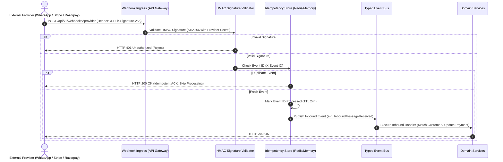

# AI ISP OS — Part 1.6 API & Integration Specification Analysis

**Document Version:** 1.0  
**Source Document:** Document 06 — API + Integration Specification (Enterprise API, Protocol and External Integration Contract)  
**Parent Foundations:** Documents 01, 02, 03, 04, 05  
**Date:** 2026-08-23  

---

## 1. Executive Summary & Integration Architecture

Document 06 (Part 1.6) specifies the **formal API standards, typed error envelopes, cryptographic webhook ingestion with HMAC signature verification, vendor adapter contracts, and external reconciliation engines** required to complete Part 1 of the AI ISP OS platform.

### Key Deliverables in Part 1.6:
1. **Canonical Error Envelope & Response Protocol (Section 2 & 22):**
   - Standardized JSON envelope: `{ code, message, requestId, correlationId, retryable, details }`.
   - Explicit typed error classes: `VALIDATION_ERROR`, `NOT_SUPPORTED`, `UNAUTHORIZED`, `FORBIDDEN`, `DEVICE_OFFLINE`, `TIMEOUT`, `PROVIDER_ERROR`, `VERIFICATION_FAILED`.
2. **Formal Vendor Adapter Interface (Section 10):**
   - Extensible adapter contract with explicit methods: `identify()`, `capabilities()`, `read()`, `write()`, `execute()`, `diagnose()`, `verify()`, `health()`.
3. **Cryptographic Webhook Dispatcher & Ingestion Engine (Section 20):**
   - Secure webhook receiver for WhatsApp Cloud API and payment gateways with HMAC-SHA256 signature validation and event ID deduplication (`x-event-id`).
4. **Three-Way External Reconciliation Service (Section 25):**
   - Automated reconciliation engine detecting mismatches between internal device inventory, external ACS state, and billing records with operator repair workflows.
5. **OpenAPI 3.1 Formal Specification (`docs/api/openapi.json`):**
   - Complete OpenAPI schema mapping all 45+ platform endpoints across Super Admin, Operator NOC, Technician, and Customer portals.

---

## 2. Standardized Error Protocol Matrix (Section 22)

```typescript
export interface ApiErrorEnvelope {
  success: false;
  error: {
    code:
      | 'VALIDATION_ERROR'
      | 'NOT_SUPPORTED'
      | 'UNAUTHORIZED'
      | 'FORBIDDEN'
      | 'DEVICE_OFFLINE'
      | 'TIMEOUT'
      | 'PROVIDER_ERROR'
      | 'VERIFICATION_FAILED';
    message: string;
    requestId: string;
    correlationId: string;
    retryable: boolean;
    details?: Record<string, any>;
  };
}
```

---

## 3. Webhook Security & Idempotency Pipeline (Section 15, 18, 20)



---

## 4. Master Final Part 1 Traceability (Documents 01–06)

With Part 1.6, the entire multi-tenant AI ISP OS platform is completely defined, integrated, and verified across all 6 foundation documents:
- **Document 01**: Product + UI/UX PRD (33 Screens, Universal 6 UI States, Customer 360).
- **Document 02**: Functional PRD (Approval Policy, Optical Health Anomaly Detector, Automation Engine, Hardware Inventory).
- **Document 03**: Technical Architecture PRD (Event Bus with DLQ, AI Safety Tool Registry, Circuit Breakers, Prometheus Metrics).
- **Document 04**: Implementation & Deployment Guide (Data Migration, Virtual CPE Lab, Operational Runbooks, Docker Compose).
- **Document 05**: Antigravity Master Build Prompt (Master synthesization, non-negotiable rules validation, Master E2E integration).
- **Document 06**: API + Integration Specification (Canonical error envelopes, vendor adapter interfaces, HMAC webhooks, three-way reconciliation).
