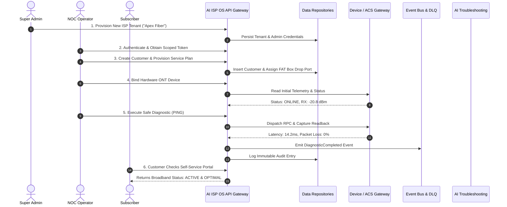

# AI ISP OS — Part 3.1 End-to-End User Flows & Journeys

**Document Version:** 1.0  
**Specification:** Part 3.1 — Production Application Implementation  
**Date:** 2026-08-23  

---

## 1. First Production Vertical Slice Journey (Section 27)

