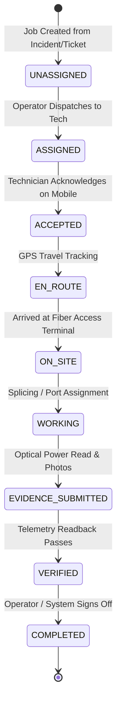

# AI ISP OS — Part 3.2 Technician Workflows & Evidence Capture

**Document Version:** 1.0  
**Specification:** Part 3.2 — Advanced Operations & Cross-Module Workflows  
**Date:** 2026-08-23  

---

## 1. Field Technician State Machine (Section 26 & 27)

