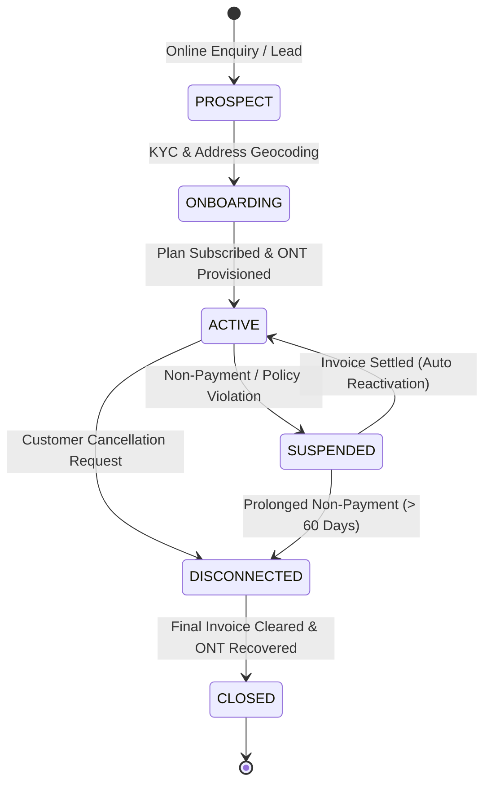

# AI ISP OS — Part 3.3 Customer Master Lifecycle & State Machine

**Document Version:** 1.0  
**Specification:** Part 3.3 — Customer Lifecycle & Business Operations  
**Date:** 2026-08-23  

---

## 1. Canonical Customer Lifecycle (Section 5)

---

## 2. Customer Master Record (Section 4)

A single authoritative `Customer` document models subscriber identity, address geocodes, assigned ONT hardware, physical fiber drop FAT ports, active subscription plan, and billing profile. No duplicate customer records exist across billing, network, support, or AI domains.
