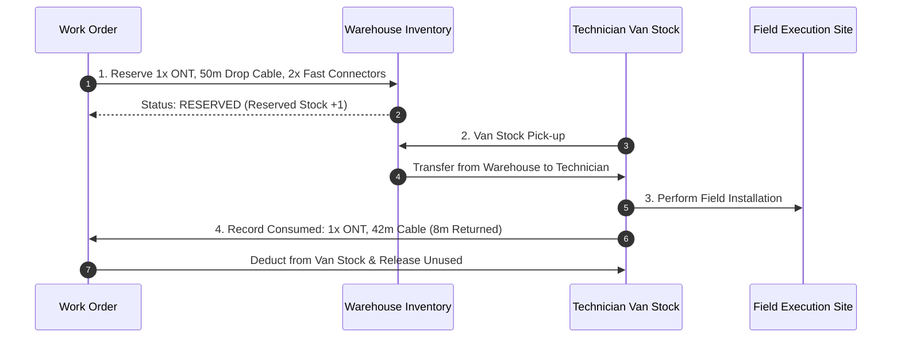

# AI ISP OS — Part 3.4 Inventory Tracking & Material Reservations

**Document Version:** 1.0  
**Specification:** Part 3.4 — Field Operations & Work Orders  
**Date:** 2026-08-23  

---

## 1. Material Reservation & Consumption Flow (Section 31 & 36)

