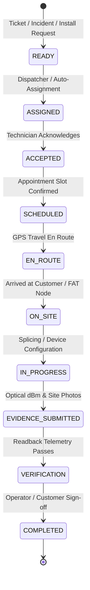

# AI ISP OS — Part 3.4 Work Order Architecture & Lifecycle

**Document Version:** 1.0  
**Specification:** Part 3.4 — Field Operations & Work Orders  
**Date:** 2026-08-23  

---

## 1. Canonical Work Order State Machine (Section 5 & 6)

