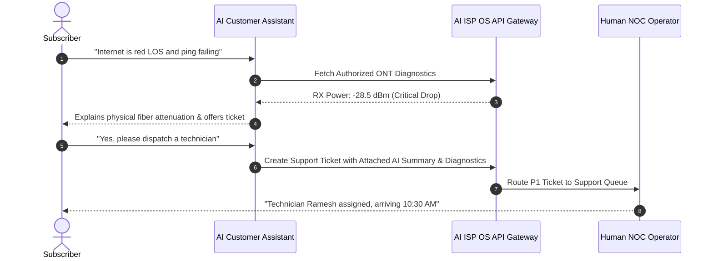

# AI ISP OS — Part 3.5 Support Architecture & Ticket Handoff

**Document Version:** 1.0  
**Specification:** Part 3.5 — Customer Self-Service & Omnichannel Support  
**Date:** 2026-08-23  

---

## 1. Support Lifecycle & Human Operator Escalation (Section 18 & 37)

